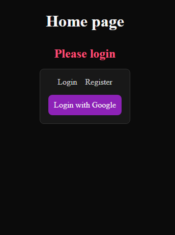

# Rest API - Backend

## Welcome

Rest API - Backend (w/ tests). Created with JS, Express, MongoDB, Mongoose, JWT, bcrypt, nanoid, pino, zod, dotenv, dayjs, cors, swagger, lodash, supertest, mocks, clearMocks, resetMocks, restoreMocks, spyOn, Google OAuth
[Live Demo](https://rest-api-1-frontend.vercel.app/) 👈

